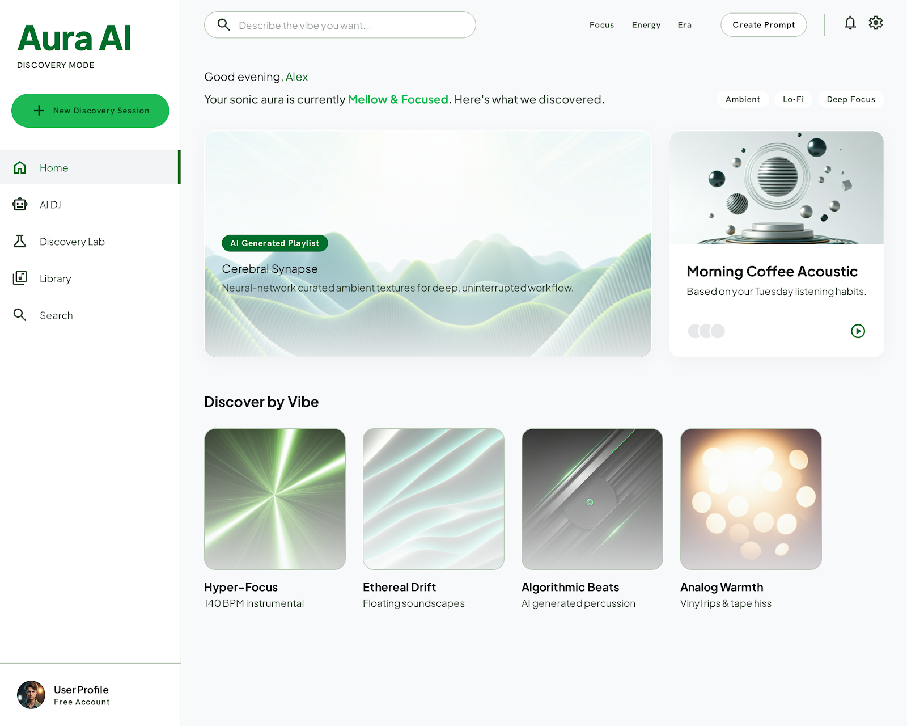

# 🎧 Spotify Discovery Analyzer

An end-to-end pipeline that **scrapes, processes, and analyzes user feedback**
about Spotify's music **discovery experience** (Discover Weekly, Release Radar,
recommendations, autoplay) and turns it into actionable product insights using a
**RAG + multi-agent** architecture.



**Live app:** deploy via [Streamlit Community Cloud](https://share.streamlit.io/) with entry point `streamlit_app.py` at the repo root.

## Features

- **Multi-source scraping** — Apple App Store, Google Play Store, Reddit (PRAW), and Twitter/X.
- **Text processing** — cleaning/normalization, sentiment analysis (VADER or transformers), and theme extraction (TF-IDF or LLM).
- **RAG pipeline** — embeddings (OpenAI or local), pluggable vector store (ChromaDB local / Pinecone cloud), and a retrieval-augmented query engine.
- **Agents** — an insight agent that produces grounded product reports and a segment analyzer that profiles different user types.
- **API** — FastAPI service exposing scrape / ingest / query / insights / segments endpoints.
- **Dashboard** — a Streamlit app for interactive exploration.

## Project structure

```
spotify-discovery-analyzer/
├── scrapers/          # Data collection
│   ├── app_store_scraper.py
│   ├── play_store_scraper.py
│   ├── reddit_scraper.py
│   └── twitter_scraper.py
├── processors/        # Cleaning + NLP
│   ├── text_cleaner.py
│   ├── sentiment_analyzer.py
│   └── theme_extractor.py
├── rag/               # Retrieval-augmented generation
│   ├── embeddings.py
│   ├── vector_store.py
│   └── query_engine.py
├── api/               # FastAPI layer
│   ├── main.py
│   └── routes.py
├── agents/            # LangChain/LangGraph agents
│   ├── insight_agent.py
│   └── segment_analyzer.py
├── frontend/          # Streamlit dashboard
│   └── streamlit_app.py
├── requirements.txt
├── .env.example
└── README.md
```

## Tech stack

| Layer            | Technology                              |
| ---------------- | --------------------------------------- |
| Language         | Python 3.11+                            |
| API              | FastAPI + Uvicorn                       |
| RAG / agents     | LangChain + LangGraph                   |
| LLMs             | OpenAI / Anthropic (Claude)             |
| Vector store     | ChromaDB (local) or Pinecone (cloud)    |
| Embeddings       | OpenAI or sentence-transformers (local) |
| Scraping         | BeautifulSoup, requests, PRAW           |
| Dashboard        | Streamlit                               |

## Getting started

### 1. Create and activate a virtual environment

**Windows (PowerShell):**

```powershell
python -m venv .venv
.\.venv\Scripts\Activate.ps1
```

**macOS / Linux:**

```bash
python3 -m venv .venv
source .venv/bin/activate
```

### 2. Install dependencies

```bash
pip install -r requirements.txt
```

### 3. Configure environment variables

```bash
cp .env.example .env   # Windows: copy .env.example .env
```

Then edit `.env` and add your API keys. At minimum set `OPENAI_API_KEY`
(or switch `LLM_PROVIDER=anthropic` and set `ANTHROPIC_API_KEY`). The default
vector store (ChromaDB) and embeddings can run fully locally if you set
`EMBEDDING_BACKEND=huggingface`.

### 4. Run the API

```bash
uvicorn api.main:app --reload
```

Interactive docs: http://localhost:8000/docs

### 5. Run the dashboard (in a second terminal)

```bash
streamlit run frontend/streamlit_app.py
```

## Typical workflow

1. **Collect** — `POST /api/v1/scrape` (or the dashboard "Collect & Ingest" tab) to pull feedback from your chosen sources.
2. **Ingest** — `POST /api/v1/ingest` cleans the text, runs sentiment + theme analysis, and indexes it into the vector store.
3. **Ask** — `POST /api/v1/query` to ask natural-language questions answered with cited evidence.
4. **Insights** — `POST /api/v1/insights` runs the insight agent for a structured report.
5. **Segments** — `GET /api/v1/segments` profiles discovery needs across user segments.

## Notes & credentials

- **Reddit**: create an app at https://www.reddit.com/prefs/apps to get a client id/secret.
- **Twitter/X**: requires a bearer token from the X developer portal (recent-search endpoint; rate limited).
- **App Store / Play Store**: no credentials required (public feeds / unofficial endpoints). Scrape responsibly and respect each platform's terms of service.

## License

For educational / research use. Review each data source's terms of service before
collecting data at scale.
